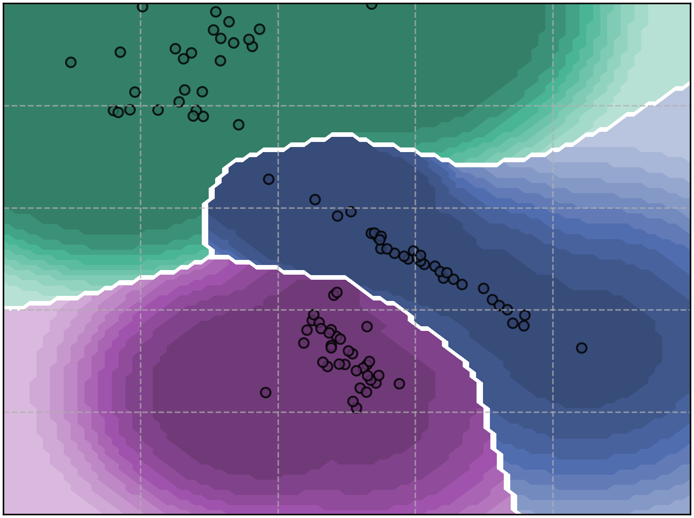
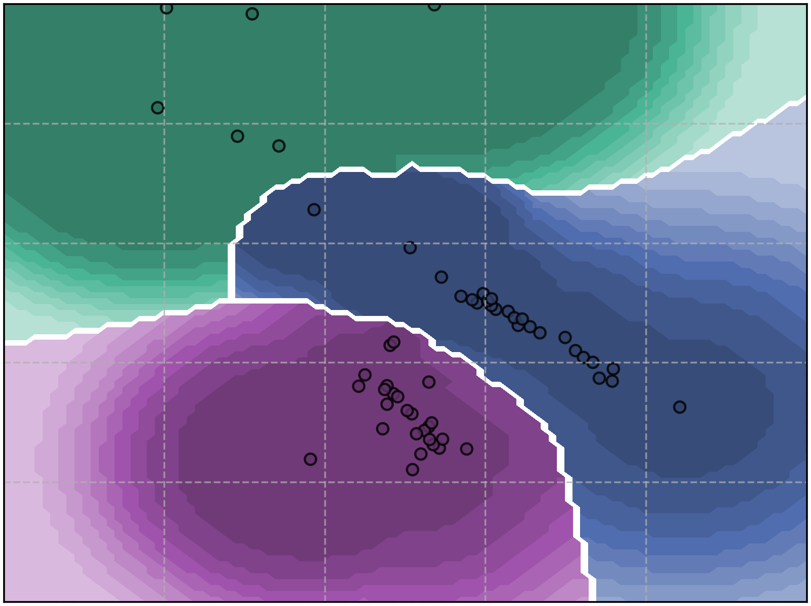
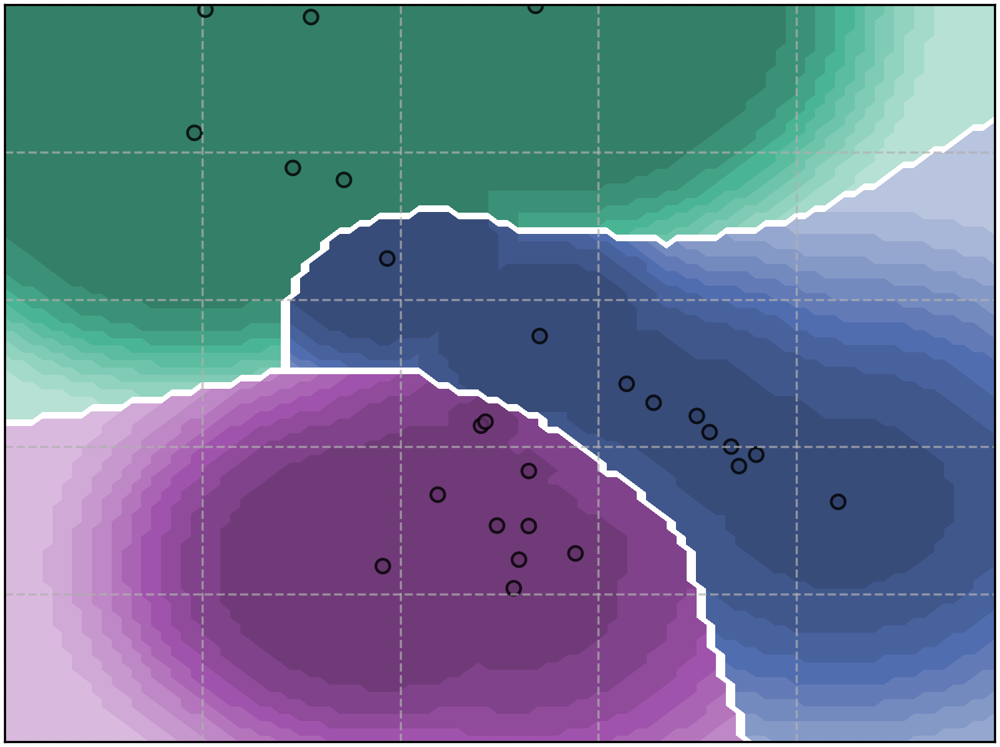
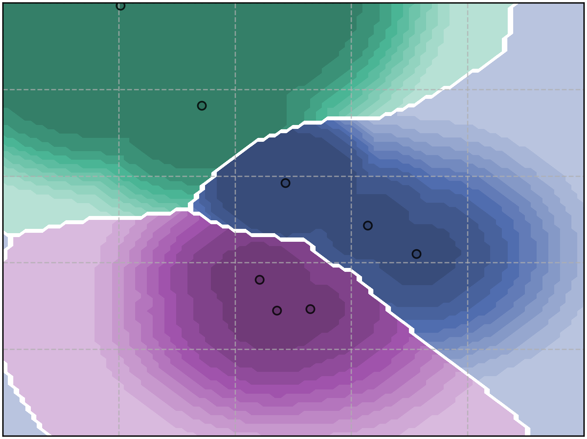
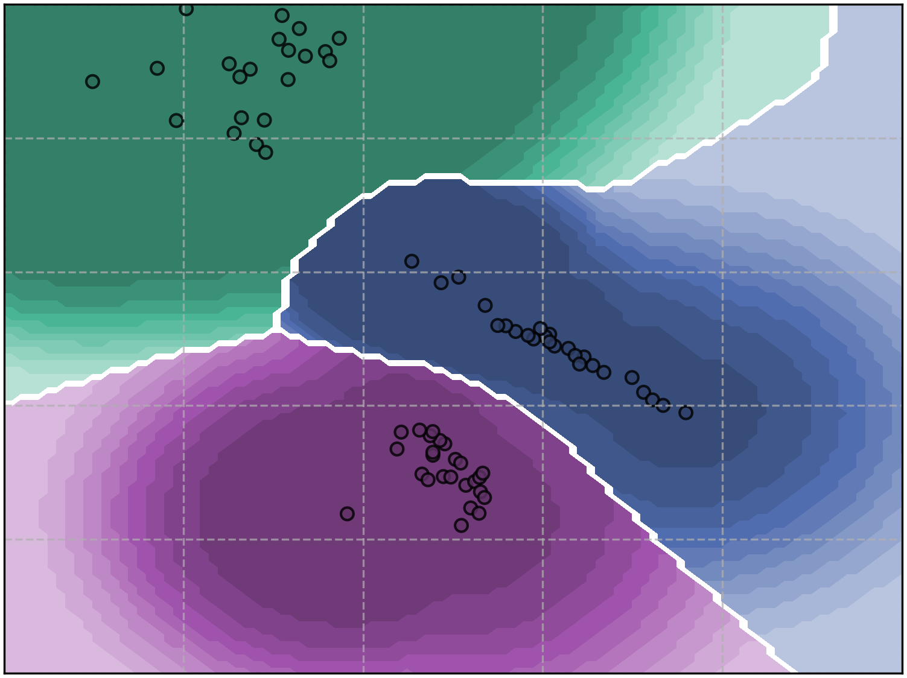
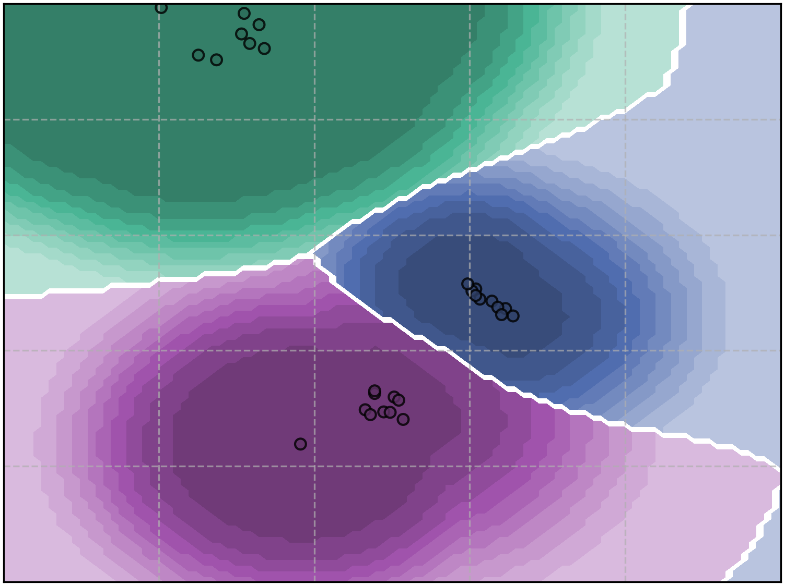
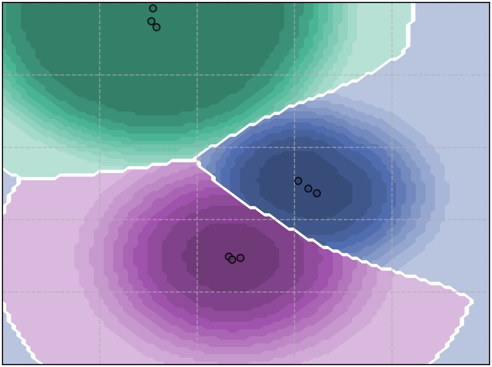

# Model Reduction - Toy Example

#### without model reduction

#### with model reduction: K is the maximum amount of extreme vectors to keep per class
| Model Reduction     | K = 25                                                                                   | K = 10                                                                                   | K = 3                                                                                 |
|---------------------|------------------------------------------------------------------------------------------|------------------------------------------------------------------------------------------|---------------------------------------------------------------------------------------|
| bisection set-cover |  |  |  |
| weighted set-cover  |   |   |   |